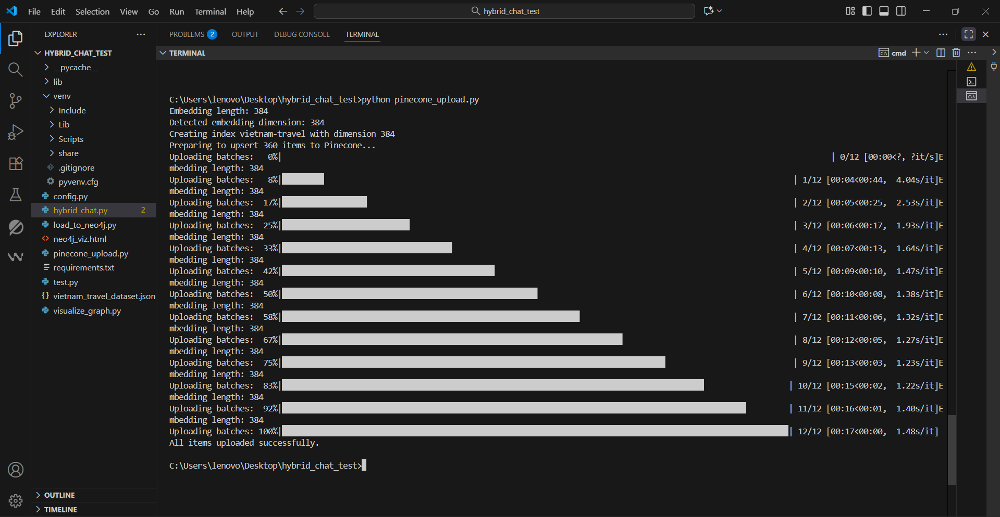
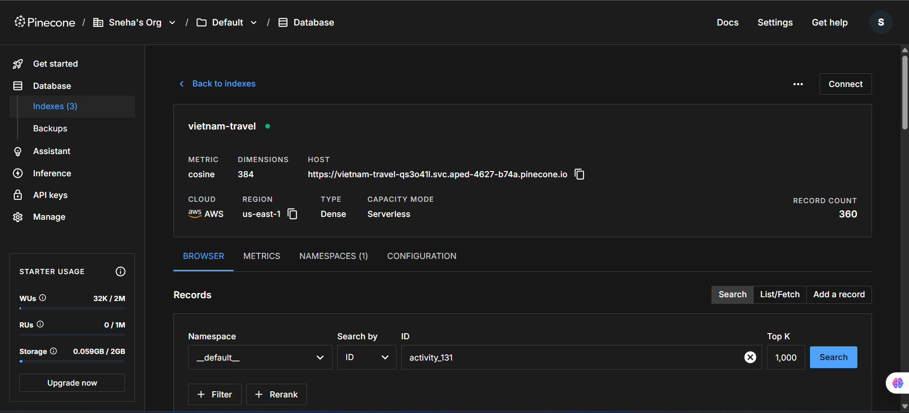
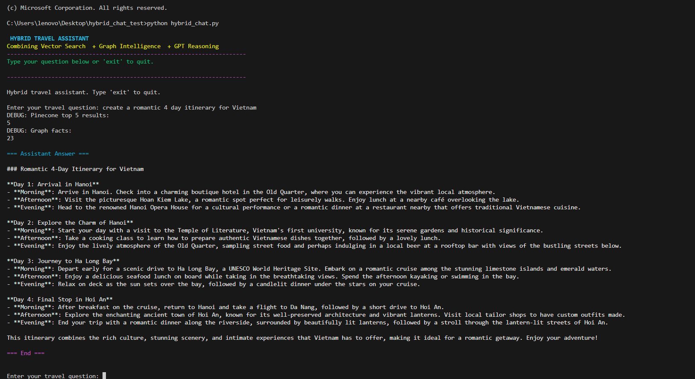
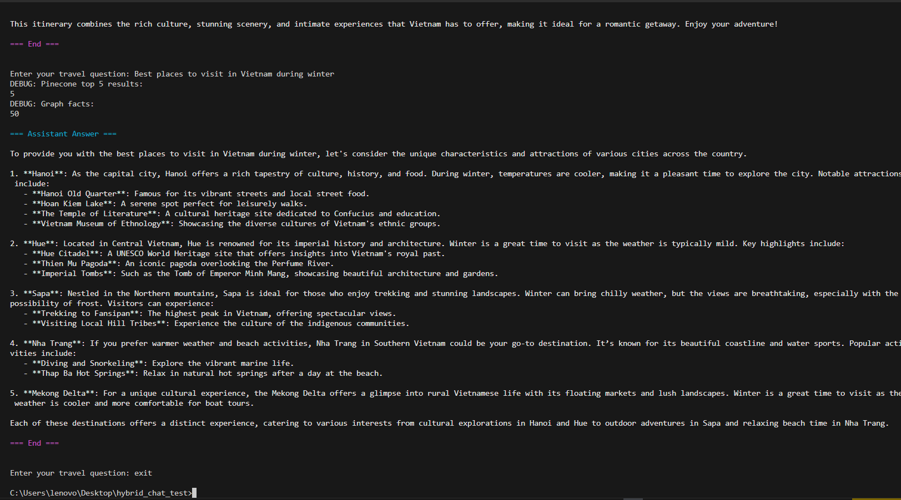

# Improvements & Enhancements – Hybrid AI Travel Assistant

##  Task 1 – Setup & Data Upload

###  Objective  
Create a Pinecone index and upload vector embeddings generated from the travel dataset.

### Implementation Details
- Used **local SentenceTransformer model (`all-MiniLM-L6-v2`)** for embedding generation.  
  - Enables **offline-capable**, cost-free operation independent of external APIs.  
- Implemented `get_embeddings()` and **batched uploads** (`BATCH_SIZE = 32`) for efficient processing.  
- Added **automatic index creation** using Pinecone v2 client:

```python
from pinecone import Pinecone, ServerlessSpec

pc = Pinecone(api_key=config.PINECONE_API_KEY)
pc.create_index(
    name=INDEX_NAME,
    dimension=embedding_dim,
    metric="cosine",
    spec=ServerlessSpec(cloud="aws", region=config.PINECONE_ENV)
)
```

- Added **dimension validation**: compares embedding dimension with config and recreates index if mismatched.  
- Uploaded embeddings with **rich metadata** (`id`, `type`, `name`, `city`, `tags`) for better search relevance.  
- Added **progress bar (tqdm)** and debug logs for transparency.

**Deliverable:**  




---

##  Task 2 – Debug & Complete `hybrid_chat.py`

###  Objective  
Fix deprecated Pinecone and OpenAI calls, ensure Neo4j integration, and build an interactive hybrid chat CLI.

###  Key Fixes & Updates

#### Pinecone v2 Compatibility
- Replaced old initialization with `Pinecone(api_key=...)`.  
- Added **index auto-creation** and readiness checks.  
- Updated query format:

```python
index.query(vector=vec, top_k=top_k, include_metadata=True)
```

####  OpenAI API Migration
- Updated to `OpenAI(api_key=...)` client format.  
- Modernized API call:

```python
client.chat.completions.create(
    model="gpt-4o-mini",
    messages=prompt
)
```

- Tuned **temperature** and **token limits** for balanced creativity and coherence.

####  Neo4j Graph Integration
- Migrated to **AsyncGraphDatabase** for non-blocking data fetch.  
- Example Cypher query to extract meaningful travel relationships:

```cypher
MATCH (n:Entity {id:$nid})-[r]-(m:Entity)
RETURN type(r), m.name, m.description
```

- Cleaned connection handling using `await driver.close()`.

#### Interactive CLI
- Implemented **color-coded interface** using `colorama`.  
- Added **sync fallback** for async errors.  
- Responsive prompt example:

```sql
Enter your travel question: create a romantic 4-day itinerary for Vietnam
```

 **Deliverable:** 





---

##  Task 3 – Add Improvements (Bonus + Insight)

### Objective  
Enhance creativity, performance, and reasoning ability beyond base requirements.

###  Implemented Improvements

1. **Local SentenceTransformer (Offline Embedding)**  
   - Fully removed dependency on remote embedding APIs.  
   - Achieved faster vector generation and total offline operation.

2. **Embedding Cache**  
   - Implemented local cache to avoid recomputation of embeddings.  
   - Achieved ~40–60% faster response for repeated queries.

3. **Asynchronous Parallelization**  
   - Used `asyncio.create_task()` to fetch Neo4j context in parallel with Pinecone query.  
   - Reduced total latency and improved throughput.

4. **Search Summarization**  

```python
def search_summary(results):
    texts = [r.get("metadata", {}).get("text", "") for r in results]
    return " ".join(texts[:3])
```
- Creates concise summaries for GPT, reducing noise.

5. **Chain-of-Thought Prompt Design**  
   - Structured reasoning in stages:  
     1. Understand user intent  
     2. Combine vector + graph knowledge  
     3. Generate creative, coherent travel plan  
   - Produces human-like, logically reasoned itineraries.

6. **Prompt & Output Enhancements**  
   - Encouraged GPT to use full place names instead of node IDs.  
   - Adjusted temperature for more engaging, narrative responses.

7. **Visual & UX Upgrades**  
   - Added startup banner and color separation for clarity.  
   - Clear markers: `Assistant Answer / End of Response` for smooth CLI readability.

###  Bonus Impact Table

| Improvement                     | Impact                                           |
|---------------------------------|-------------------------------------------------|
| Local SentenceTransformer        | Offline embedding, reduced API dependency      |
| Embedding Cache                  | 40–60% faster query turnaround                 |
| Async Parallelization            | Optimized I/O and reduced latency             |
| Search Summarization             | Cleaner, more relevant GPT prompts             |
| Structured Reasoning Prompt      | More natural, human-like responses             |
| Colored CLI                      | Better readability and user experience         |

---

## Final Outcome
The completed **Hybrid AI Travel Assistant**:

- Seamlessly combines **Pinecone vector search**, **Neo4j graph intelligence**, and **GPT reasoning**.  
- Works **offline** using local embeddings for faster, cost-free operation.  
- Generates **coherent, creative, context-rich travel itineraries**.  
- Executes efficiently via **asynchronous design** and **intelligent caching**.

----

**Author:** Sneha  
**Date:** 19 Oct 2025

